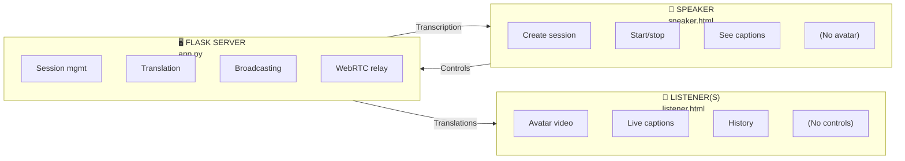

# Azure Speech Translation Avatar

Real-time speech translation with AI avatar synthesis. A speaker talks in one language, and listeners see an AI avatar speak the translation in their chosen language.

> **Status**: ✅ Local deployment tested | ⏳ Cloud deployment testing pending

## Features

| Feature | Description |
|---------|-------------|
| 🎤 **Real-time Translation** | Continuous speech recognition with live translation |
| 🤖 **AI Avatar** | Azure Avatar synthesizes translated speech with lip-sync |
| 👥 **Speaker/Listener Mode** | Separate interfaces for presenter and audience |
| 📡 **WebRTC Streaming** | Low-latency avatar video via WebRTC |
| 🔄 **Real-time Broadcasting** | All listeners receive translations simultaneously via Socket.IO |
| 🌐 **Language Support** | https://learn.microsoft.com/en-us/azure/ai-services/speech-service/language-support?tabs=speech-translation |

## Quick Start

### Prerequisites

- Python 3.8+
- Azure Speech Service
- Speech to Text Avatar and Custom Avatar https://learn.microsoft.com/en-us/azure/ai-services/speech-service/text-to-speech-avatar/what-is-text-to-speech-avatar
- Modern browser (Chrome, Edge, Firefox)

### Azure Avatar Setup

This application requires Azure Text-to-Speech Avatar. You can use prebuilt avatars or create custom avatars.

#### Prebuilt Avatars

Prebuilt avatars are available out-of-the-box once you have an Azure Speech resource. No additional setup required.

#### Custom Avatar (Limited Access)

> ⚠️ **Access Required**: Custom text-to-speech avatar access is limited based on eligibility and usage criteria. Request access on the [intake form](https://aka.ms/customneural).

Custom avatars allow you to create a personalized, branded avatar from video recordings:

1. **Request Access**: Submit the [intake form](https://aka.ms/customneural) for custom avatar access
2. **Get Consent**: Obtain recorded consent statement from the talent
3. **Prepare Training Data**: Refer to the documentation below for preparing videos
4. **Train Model**: Use [Microsoft Foundry Portal](https://ai.azure.com) or Speech Studio to train your avatar
5. **Deploy**: Deploy the trained model to your Speech resource

📖 **Documentation**:
- [What is Custom Text-to-Speech Avatar](https://learn.microsoft.com/en-us/azure/ai-services/speech-service/text-to-speech-avatar/what-is-custom-text-to-speech-avatar)
- [How to Create a Custom Avatar](https://learn.microsoft.com/en-us/azure/ai-services/speech-service/text-to-speech-avatar/custom-avatar-create?pivots=ai-foundry-portal)
- [How to Record Training Videos](https://learn.microsoft.com/en-us/azure/ai-services/speech-service/text-to-speech-avatar/custom-avatar-record-video-samples)

### Responsible AI

When creating custom avatars or custom neural voices, you must follow Microsoft's Responsible AI guidelines:

#### Voice & Avatar Talent Consent

- **Written Permission**: Obtain explicit written consent from talent before using their voice or likeness
- **Informed Consent**: Ensure talent understands how text-to-speech and avatar synthesis works
- **Recorded Statement**: Upload a consent video with the talent acknowledging usage of their voice/image
- **Usage Transparency**: Share intended use cases so talent knows who will interact with their synthetic likeness

📖 **Documentation**:
- [Disclosure for Voice and Avatar Talent](https://learn.microsoft.com/en-us/azure/ai-foundry/responsible-ai/speech-service/text-to-speech/disclosure-voice-talent)
- [Transparency Note for Custom Neural Voice](https://learn.microsoft.com/en-us/azure/ai-foundry/responsible-ai/speech-service/text-to-speech/transparency-note)
- [Disclosure Design Guidelines](https://learn.microsoft.com/en-us/azure/ai-foundry/responsible-ai/speech-service/text-to-speech/concepts-disclosure-guidelines)
- [Disclosure design patterns](https://learn.microsoft.com/en-us/azure/ai-foundry/responsible-ai/speech-service/text-to-speech/concepts-disclosure-patterns-avatar?view=foundry-classic)
- [Data, Privacy and Security](https://learn.microsoft.com/en-us/azure/ai-foundry/responsible-ai/speech-service/text-to-speech/data-privacy-security?view=foundry-classic&tabs=custom-avatar)

## Use Cases

Real-time speech translation avatars enable multilingual communication across various industries:

### Enterprise & Corporate
- **Internal Townhalls** — Executive communications to global workforce in multiple languages
- **Sales Conversations** — Customer engagements with real-time translation
- **Training & Onboarding** — Multilingual employee training sessions
- **All-Hands Meetings** — Organization-wide announcements with live translation

### Customer Service
- **Virtual Agents** — AI-powered customer support with human-like avatars
- **Help Desk** — Technical support across language barriers
- **Banking & Financial Services** — Multilingual customer assistance

### Healthcare
- **Patient Communication** — Medical consultations with non-native speakers
- **Telehealth** — Remote healthcare with real-time translation
- **Medical Training** — Educational content for international medical staff

### Education
- **Online Learning** — Lectures and courses accessible in multiple languages
- **Interactive Lessons** — Engaging educational content with avatar presenters
- **Museum Tours** — Multilingual guided experiences

### Media & Entertainment
- **Broadcasting** — News and content delivery in multiple languages
- **Gaming** — In-game characters with localized speech
- **Live Events** — Conferences and presentations with real-time translation

### Accessibility
- **ALS Voice Preservation** — Preserving voices for those with speech impairments
- **Real-time Translation** — Breaking down language barriers for accessibility

### Installation

```powershell
# 1. Create and activate virtual environment
python -m venv venv
.\venv\Scripts\Activate      # Windows PowerShell
# source venv/bin/activate   # macOS/Linux

# 2. Install dependencies
pip install -r requirements.txt

# 3. Configure Azure credentials
cp .env.example .env
# Edit .env with your SPEECH_REGION and SPEECH_KEY

# 4. Run the application
python -m flask run --host=0.0.0.0 --port=5000
```

### Usage

1. **Speaker** opens `http://localhost:5000/speaker`
2. Configure session (name, source language, target language, avatar)
3. Click **Create Session** → Copy the listener URL
4. **Listeners** open the listener URL in their browsers
5. **Wait** for the avatar to connect (video appears in listener window)
6. Speaker clicks **Start Speaking** → All listeners see the avatar + translations

> 📋 **Demo Sequence**: Always wait for the listener's avatar to fully connect before the speaker starts talking. The avatar connection takes a few seconds — you'll see the video feed appear when ready.

> ⚠️ **Demo Tip**: Avoid running speaker and listener on the same device — the microphone will pick up the avatar's audio output, causing feedback loops. Use **Dev Tunnels** to share the listener URL and open it on a separate device (phone, tablet, or another computer) for the best demo experience.

## How It Works



**Speaker** controls translation; **Listeners** see/hear the avatar. Translation results are broadcast to all listeners via Socket.IO, while each listener has their own WebRTC connection to Azure Avatar Service.

## Configuration

### Environment Variables

Create a `.env` file with your Azure credentials:

```env
# Required
SPEECH_REGION=
SPEECH_KEY=your_speech_service_key

# Optional
PORT=5000
ICE_SERVER_URL=           # Custom TURN server
ICE_SERVER_USERNAME=
ICE_SERVER_PASSWORD=
```

### Supported Languages

https://learn.microsoft.com/en-us/azure/ai-services/speech-service/text-to-speech-avatar/what-is-text-to-speech-avatar

Custom avatars trained in Azure Speech Studio are also supported.

## API Reference

### Routes

| Route | Method | Description |
|-------|--------|-------------|
| `/speaker` | GET | Speaker control interface |
| `/listener/<session_id>` | GET | Listener interface with avatar |
| `/api/createSession` | POST | Create translation session |
| `/api/getSession/<id>` | GET | Get session information |
| `/api/startTranslation` | POST | Start translation (speaker) |
| `/api/stopTranslation` | POST | Stop translation |
| `/api/endSession` | POST | End session and notify listeners |
| `/api/connectListenerAvatar` | POST | Connect listener to avatar (WebRTC) |
| `/api/getIceToken` | GET | Get ICE/TURN credentials |

### Socket.IO Events

| Event | Direction | Description |
|-------|-----------|-------------|
| `joinSession` | Client → Server | Listener joins session room |
| `translationResult` | Server → Clients | Broadcast translation to session |
| `listenerJoined` | Server → Speaker | New listener notification |
| `listenerCountUpdated` | Server → All | Updated listener count |
| `sessionEnded` | Server → Listeners | Session terminated |
| `audioData` | Speaker → Server | Browser audio streaming (16kHz PCM) |

## Remote Access

### Option 1: VS Code Dev Tunnels (Recommended)

```
1. Open PORTS tab in VS Code
2. Forward port 5000
3. Set visibility to "Public"
4. Share the tunnel URL with listeners
```

### Option 2: ngrok

```powershell
ngrok http 5000
# Share the https URL
```

> **Note**: HTTPS is required for microphone access in browsers.

## Troubleshooting

| Issue | Solution |
|-------|----------|
| Avatar not connecting | Verify SPEECH_KEY and SPEECH_REGION in .env |
| No microphone input | HTTPS required for mic access (use Dev Tunnels) |
| Listeners not receiving translations | Check Socket.IO connection in browser console |
| WebRTC failed | Check firewall isn't blocking TURN traffic |

## Documentation

| Document | Description |
|----------|-------------|
| [1-ARCHITECTURE.md](docs/1-ARCHITECTURE.md) | System architecture and data flows |
| [2-SETUP-LOCAL.md](docs/2-SETUP-LOCAL.md) | Local development setup |
| [3-SETUP-AZURE.md](docs/3-SETUP-AZURE.md) | Azure deployment guide |
| [4-IMPLEMENTATION.md](docs/4-IMPLEMENTATION.md) | Code implementation details |
| [5-TESTING.md](docs/5-TESTING.md) | Testing scenarios and checklist |

## Project Structure

```
avatar-translation/
├── app.py                 # Flask server with Socket.IO
├── speaker.html           # Speaker control interface
├── listener.html          # Listener avatar interface
├── static/
│   ├── css/styles.css     # Shared styles
│   └── js/
│       ├── speaker.js     # Speaker client logic
│       └── listener.js    # Listener client logic (WebRTC)
├── scripts/               # Deployment and utility scripts
│   ├── start.ps1          # Quick start script
│   ├── deploy-docker.ps1  # Docker deployment
│   └── deploy-azure-app-service.ps1  # Azure deployment
├── docs/                  # Documentation
├── .env.example           # Environment template
├── requirements.txt       # Python dependencies
└── Dockerfile             # Container build
```

## Technology Stack

- **Backend**: Flask + Flask-SocketIO + Eventlet
- **Frontend**: Vanilla JS + Socket.IO client
- **Streaming**: WebRTC for avatar video, Socket.IO for translations
- **Azure Services**: Speech Translation, Speech Synthesis, Avatar Synthesis
