# Architecture

> **Status**: ✅ Local deployment tested | ⏳ Cloud deployment testing pending

## Overview

The Azure Speech Translation Avatar application uses a **Speaker/Listener mode** with session-based communication:

- **Speaker Mode**: Controls translation settings, starts/stops translation, manages session. Does NOT see avatar video/audio.
- **Listener Mode**: Receives avatar video/audio and live translations. NO controls, avatar-only experience.

## High-Level Architecture

```mermaid
flowchart TB
    subgraph Server["🖥️ FLASK SERVER (app.py)"]
        subgraph Routes["HTTP Routes"]
            R1["/speaker"]
            R2["/listener/id"]
            R3["/api/*"]
        end
        subgraph SocketIO["Socket.IO"]
            SO1[Rooms]
            SO2[Broadcasting]
            SO3[Tracking]
        end
        subgraph Sessions["Session Management"]
            SM1[Storage]
            SM2["{id: {...}}"]
        end
        subgraph SDK["Azure Speech SDK Integration"]
            SDK1[TranslationRecognizer]
            SDK2[SpeechSynthesizer]
            SDK3[WebRTC Connection]
        end
    end
    
    subgraph Azure["☁️ Azure Speech Service"]
        A1[Speech Recognition]
        A2[Translation]
        A3[Avatar Synthesis]
    end
    
    subgraph SpeakerUI["🎤 SPEAKER UI (speaker.html)"]
        SP1[Session Management]
        SP2[Controls]
        SP3[Transcription]
        SP4[Listener Count]
        SP5["❌ NO AVATAR"]
    end
    
    subgraph ListenerUI["👁️ LISTENER UI (listener.html)"]
        LI1[Avatar Video]
        LI2[Translation Display]
        LI3[History]
        LI4[Audio/Visual]
        LI5["❌ NO CONTROLS"]
    end
    
    Server <--> Azure
    Azure --> SpeakerUI
    Azure --> ListenerUI
    SpeakerUI <--> Server
    ListenerUI <--> Server
```

## Session Communication Flow

```mermaid
flowchart TD
    A[Speaker creates session] --> B[Gets unique 6-digit code]
    B --> C[Generates listener URL]
    C --> D[Speaker starts translation and speaks]
    D --> E[Translation broadcast to session room via Socket.IO]
    E --> F[All listeners in session receive:]
    F --> G[📝 Real-time translations]
    F --> H[🎥 Avatar video/audio via WebRTC]
    F --> I[📜 Translation history]
```

## Session Flow Phases

### Phase 1: Session Creation

### Phase 2: Listener Joins

### Phase 3: Translation

```mermaid
sequenceDiagram
    participant Speaker
    participant Server
    participant Listeners as Listeners (All)
    
    Speaker->>Server: POST /api/startTranslation
    Note over Server: Start TranslationRecognizer
    Speaker->>Server: 🎤 Speak into mic (audioData)
    Note over Server: Recognize → Translate → Synthesize avatar
    Server->>Listeners: emit('translationResult')
    Server-->>Speaker: Update transcription
    Note over Listeners: 🗣️ Avatar speaks
```

### Phase 4: Session End

## WebRTC Avatar Connection Flow

## Socket.IO Room Architecture

## Data Flow - Single Translation

```mermaid
flowchart TD
    A["🎤 SPEAKER SPEAKS<br/>Hello, how are you?"]
    
    B["1️⃣ MICROPHONE CAPTURE<br/>Browser getUserMedia API → Azure Speech SDK"]
    
    C["2️⃣ SPEECH RECOGNITION<br/>Language: en-US → Hello, how are you?"]
    
    D["3️⃣ TRANSLATION<br/>Target: es-ES → Hola, ¿cómo estás?"]
    
    E["4️⃣ AVATAR SYNTHESIS<br/>Voice: es-ES-ElviraNeural → Video + Audio"]
    
    F["🔗 WebRTC"]
    
    G["👤 LISTENER 1<br/>🗣️ Avatar plays<br/>Hola, ¿cómo estás?"]
    H["👤 LISTENER 2<br/>🗣️ Avatar plays<br/>Hola, ¿cómo estás?"]
    
    A --> B --> C --> D --> E --> F
    F --> G
    F --> H
```

## Session State Machine

```mermaid
stateDiagram-v2
    [*] --> INITIAL: No session exists
    
    INITIAL --> CREATED: POST /api/createSession
    note right of CREATED
        active: false
        • Has session ID & configuration
        • Listener URL generated
    end note
    
    CREATED --> ACTIVE: Listeners join +<br/>POST /api/startTranslation
    note right of ACTIVE
        active: true
        • Translations broadcasting
        • Avatars speaking
    end note
    
    ACTIVE --> PAUSED: POST /api/stopTranslation
    note right of PAUSED
        active: false
        • Can resume translation
        • History preserved
    end note
    
    PAUSED --> ACTIVE: POST /api/startTranslation
    PAUSED --> ENDED: POST /api/endSession
    ACTIVE --> ENDED: POST /api/endSession
    
    note right of ENDED
        • Listeners notified
        • Removed from storage
    end note
    
    ENDED --> [*]
```

## Key Components

### Backend (app.py)

| Component | Purpose |
|-----------|---------|
| Session Management | In-memory storage of active sessions |
| HTTP Routes | `/speaker`, `/listener/<id>`, `/api/*` |
| Socket.IO Rooms | Session-based broadcasting |
| WebRTC Integration | Avatar video streaming |

### Frontend Files

| File | Purpose |
|------|---------|
| `speaker.html` | Speaker control panel |
| `listener.html` | Listener avatar display |
| `static/js/speaker.js` | Speaker logic |
| `static/js/listener.js` | Listener logic with WebRTC |

## Scaling Considerations

- **Current**: In-memory sessions (single server)
- **Production**: Use Redis for session storage