# Building Real-Time Speech Translation with AI Avatars Using Azure Speech Services

*Breaking language barriers with AI-powered avatars that speak your audience's language*

---

## Introduction

Traditionally, language barriers have remained as one of the biggest challenges in communication. Whether it is holding an all-hands meeting for gloabally distributed setup, a healthcare provider consulting with non-native speaking patients, or an educator reaching students across continents—the need for seamless, real-time translation is critical in communication.

Language barriers and ineffective tools can feel impersonal and disconnected. Text captions scroll across screens while speakers continue in their native tongue, creating a disjointed experience. What if instead, your audience could see and hear an AI avatar speaking directly to them in their own language, with natural lip-sync and human-like expressions?

**Azure Speech Translation Avatar** is a real-time speech translation solution where a speaker talks in one language, and listeners see an AI avatar delivering the translated speech in their chosen language.

Imagine a CEO in Tokyo delivering a quarterly update. Employees in Munich, São Paulo, and Mumbai each see an AI avatar speaking to them in German, Portuguese, and Hindi respectively—all in real-time, with synchronized lip movements and natural speech patterns. The speaker focuses on their message; the technology handles the rest.

---

## How It Works

The Avatar Speech translation app supports **separate speaker and listener modes** with session-based communication:

- **Speaker Mode**: Controls translation settings, starts/stops translation, manages session. Does NOT see avatar video/audio.
- **Listener Mode**: Receives avatar video/audio and live translations. NO controls, avatar-only experience.

The application uses a **Speaker/Listener architecture** that separates the presenter experience from the audience experience:

### Speaker Mode
- Controls translation settings (source language, target language, avatar selection)
- Creates and manages sessions with unique 6-digit codes
- Starts/stops translation
- Sees live transcription and listener count
- **Does not see the avatar** (prevents audio feedback)

### Listener Mode
- Joins via a shareable URL containing the session code
- Sees the AI avatar video with synchronized lip movements
- Hears translated speech in the target language
- Views translation history
- **No controls**—pure viewing experience

### The Technology Stack

```mermaid
flowchart TB
    subgraph Speaker["🎤 SPEAKER"]
        S1[Microphone]
        S2[Controls]
        S3[Transcription]
    end
    
    subgraph Server["🖥️ FLASK SERVER"]
        SV1[Session Management]
        SV2[Translation]
        SV3[Broadcasting]
    end
    
    subgraph Listeners["👥 LISTENER(S)"]
        L1[Avatar Video]
        L2[Live Captions]
        L3[Audio Output]
    end
    
    subgraph Azure["☁️ Azure Speech Service"]
        A1[Speech Recognition]
        A2[Translation]
        A3[Avatar Synthesis]
    end
    
    Speaker -->|Audio Stream| Server
    Server -->|Translations| Speaker
    Server -->|Translations| Listeners
    Server <-->|API Calls| Azure
    Azure -->|WebRTC Video| Listeners
```



---

## Implementation Deep Dive

### Core Components

#### 1. Backend: Flask + Socket.IO

The server is built with **Flask** and **Flask-SocketIO** using the **Eventlet** async worker for WebSocket support. This combination provides:

- **HTTP endpoints** for session management and avatar connection
- **WebSocket rooms** for real-time translation broadcasting
- **Session storage** for managing multiple concurrent translation sessions

```python
# Session structure
sessions = {
    "123456": {
        "name": "Q1 Townhall",
        "source_language": "en-US",
        "target_language": "ja-JP",
        "avatar": "lisa",
        "listeners": set(),
        "is_translating": False
    }
}
```

#### 2. Audio Streaming: Browser to Server

Rather than using server-side microphone access, we capture audio directly in the browser using the **Web Audio API**:

```javascript
// Speaker captures microphone at 16kHz
const audioContext = new AudioContext({ sampleRate: 16000 });
const mediaStream = await navigator.mediaDevices.getUserMedia({ audio: true });

// Process audio and send via Socket.IO
processor.onaudioprocess = (event) => {
    const pcmData = convertToPCM16(event.inputBuffer);
    socket.emit('audioData', { sessionId, audioData: pcmData });
};
```

This approach works seamlessly across different deployment environments without requiring server microphone permissions.

#### 3. Azure Speech Translation

The server receives audio chunks and feeds them to Azure's **TranslationRecognizer** via a **PushAudioInputStream**:

```python
# Configure translation
translation_config = speechsdk.translation.SpeechTranslationConfig(
    subscription=SPEECH_KEY,
    region=SPEECH_REGION
)
translation_config.speech_recognition_language = "en-US"
translation_config.add_target_language("ja")

# Push audio stream
push_stream = speechsdk.audio.PushAudioInputStream()
audio_config = speechsdk.audio.AudioConfig(stream=push_stream)

# Handle recognition results
def on_recognized(evt):
    translation = evt.result.translations["ja"]
    socketio.emit('translationResult', {
        'original': evt.result.text,
        'translated': translation
    }, room=session_id)
```

#### 4. Avatar Synthesis with WebRTC

Each listener establishes a **WebRTC** connection to Azure's Avatar Service:

1. **ICE Token Exchange**: Server provides TURN server credentials
2. **SDP Negotiation**: Browser and Azure exchange session descriptions
3. **Avatar Connection**: Listener sends local SDP offer, receives remote answer
4. **Video Stream**: Avatar video flows directly to listener via WebRTC

```javascript
// Listener connects to avatar
const peerConnection = new RTCPeerConnection(iceConfig);
const offer = await peerConnection.createOffer();
await peerConnection.setLocalDescription(offer);

// Send to Azure Avatar Service
const response = await fetch('/api/connectListenerAvatar', {
    method: 'POST',
    headers: { 'session-id': sessionId },
    body: JSON.stringify({ sdp: offer.sdp })
});

const { sdp: remoteSdp } = await response.json();
await peerConnection.setRemoteDescription({ type: 'answer', sdp: remoteSdp });
```

#### 5. Real-Time Broadcasting

When the speaker talks, translations flow to all listeners simultaneously:

```mermaid
flowchart LR
    A[🎤 Speaker speaks] --> B[Audio sent to server]
    B --> C[Azure translates]
    C --> D[Server broadcasts via Socket.IO]
    D --> E[All listeners receive translation]
    E --> F[🗣️ Avatar speaks with lip-sync]
```



Each listener maintains their own WebRTC connection to the Avatar Service, ensuring independent video streams while receiving synchronized translation text.

### Key Design Decisions

| Decision | Rationale |
|----------|-----------|
| **Browser audio capture** | Works in any environment; no server mic permissions needed |
| **Session-based rooms** | Isolates translation streams; supports multiple concurrent sessions |
| **Separate speaker/listener UIs** | Prevents audio feedback; optimizes each experience |
| **Socket.IO for broadcasts** | Reliable real-time delivery; automatic reconnection |
| **WebRTC for avatar** | Low-latency video; peer-to-peer efficiency |

---

## Application Areas

Real-time speech translation with AI avatars opens up transformative possibilities across industries:

### 🏢 Enterprise & Corporate

**Internal Townhalls & All-Hands Meetings**
Global organizations can deliver executive communications where every employee hears the message in their native language—not through subtitles, but through an avatar that speaks directly to them.

**Sales Conversations**
Sales teams can engage international prospects without language barriers. The avatar creates a more personal connection than text translation while maintaining the authenticity of the original speaker's message.

**Training & Onboarding**
Standardized training content can reach employees worldwide, with each viewer experiencing the content in their preferred language through an engaging avatar presenter.

### 🏥 Healthcare

**Patient Communication**
Healthcare providers can consult with patients who speak different languages, with the avatar delivering medical information clearly and accurately in the patient's native tongue.

**Telehealth**
Remote healthcare consultations become accessible to non-native speakers, improving health outcomes by ensuring patients fully understand their care instructions.

### 🎓 Education

**Online Learning**
Educational institutions can expand their reach globally, with lectures and courses automatically available in multiple languages through avatar presenters.

**Interactive Lessons**
Engaging educational content with avatar presenters can captivate students while delivering content in their native language.

**Museum Tours**
Cultural institutions can offer multilingual guided experiences where visitors receive personalized tours in their language of choice.

### 📺 Media & Entertainment

**Broadcasting**
News organizations and content creators can deliver content to international audiences with localized avatar presenters, maintaining engagement while breaking language barriers.

**Live Events**
Conferences, product launches, and presentations can reach global audiences with real-time translated avatar streams for each language group.

### ♿ Accessibility

**ALS Voice Preservation**
Individuals with speech impairments can preserve their voice and communicate through personalized avatars that speak on their behalf.

**Real-Time Translation**
Breaking down language barriers makes content accessible to diverse populations who might otherwise be excluded.

---

## Custom Avatars: Your Brand, Your Voice

While prebuilt avatars work great for many scenarios, organizations can create **custom avatars** that represent their brand:

### The Process

1. **Request Access**: Custom avatar access requires approval via [Microsoft's intake form](https://aka.ms/customneural)
2. **Record Training Data**: Capture at least 10 minutes of video of your avatar talent
3. **Obtain Consent**: Get recorded consent from the talent acknowledging use of their likeness
4. **Train the Model**: Use Microsoft Foundry Portal to train your custom avatar
5. **Deploy**: Deploy the trained model to your Azure Speech resource

### Responsible AI Considerations

Creating synthetic representations of people comes with ethical responsibilities:

- **Explicit Written Consent**: Always obtain permission from the talent
- **Informed Consent**: Ensure talent understands how the technology works
- **Usage Transparency**: Share intended use cases with the talent
- **Prohibited Uses**: Never use for deception, misinformation, or impersonation

Microsoft provides comprehensive [Responsible AI guidelines](https://learn.microsoft.com/en-us/azure/ai-foundry/responsible-ai/speech-service/text-to-speech/disclosure-voice-talent) that must be followed when creating custom avatars.

---

## Getting Started

Ready to build your own real-time translation avatar application? Here's what you need:

### Prerequisites
- Python 3.8+
- Azure Speech Service subscription
- Modern browser (Chrome, Edge, Firefox)

### Quick Start

```powershell
# 1. Create and activate virtual environment
python -m venv venv
.\venv\Scripts\Activate

# 2. Install dependencies
pip install -r requirements.txt

# 3. Configure Azure credentials
cp .env.example .env
# Edit .env with your SPEECH_REGION and SPEECH_KEY

# 4. Run the application
python -m flask run --host=0.0.0.0 --port=5000
```

### Demo Sequence

1. Open `http://localhost:5000/speaker`
2. Configure session (name, source language, target language, avatar)
3. Click **Create Session** → Copy the listener URL
4. Open the listener URL in another browser/device
5. **Wait** for the avatar to connect (video appears)
6. Start speaking → Listeners see the avatar + translations

> **Tip**: For the best demo experience, open the listener URL on a separate device to avoid audio feedback from the avatar's output being picked up by the speaker's microphone.

---

## Conclusion

Real-time speech translation with AI avatars represents a significant leap forward in how we communicate across language barriers. By combining Azure's powerful Speech Translation, Text-to-Speech, and Avatar Synthesis services, we can create experiences that feel personal and engaging—not just functional.

The speaker/listener architecture ensures clean separation of concerns: speakers focus on their message while listeners receive a tailored, localized experience. WebRTC provides low-latency video streaming, Socket.IO enables real-time translation broadcasting, and Azure handles the complex AI processing.

Whether you're a global enterprise looking to connect your workforce, a healthcare provider serving diverse communities, or an educator reaching international students—this technology makes truly inclusive communication possible.

The future of multilingual communication isn't about reading subtitles. It's about having someone speak directly to you in your language.

---

## Resources

- [Azure Speech Service Documentation](https://learn.microsoft.com/en-us/azure/ai-services/speech-service/)
- [Text-to-Speech Avatar Overview](https://learn.microsoft.com/en-us/azure/ai-services/speech-service/text-to-speech-avatar/what-is-text-to-speech-avatar)
- [Custom Avatar Creation Guide](https://learn.microsoft.com/en-us/azure/ai-services/speech-service/text-to-speech-avatar/custom-avatar-create)
- [Responsible AI for Voice & Avatar](https://learn.microsoft.com/en-us/azure/ai-foundry/responsible-ai/speech-service/text-to-speech/disclosure-voice-talent)
- [Language Support](https://learn.microsoft.com/en-us/azure/ai-services/speech-service/language-support?tabs=speech-translation)

---

*Built with Azure Speech Services, Flask, Socket.IO, and WebRTC.*
