```mermaid
flowchart TB
    subgraph Speaker["🎤 SPEAKER"]
        S1[Microphone]
        S2[Controls]
        S3[Transcription]
    end
    
    subgraph Server["🖥️ FLASK SERVER"]
        SV1[Session Management]
        SV2[Translation]
        SV3[Broadcasting]
    end
    
    subgraph Listeners["👥 LISTENER(S)"]
        L1[Avatar Video]
        L2[Live Captions]
        L3[Audio Output]
    end
    
    subgraph Azure["☁️ Azure Speech Service"]
        A1[Speech Recognition]
        A2[Translation]
        A3[Avatar Synthesis]
    end
    
    Speaker -->|Audio Stream| Server
    Server -->|Translations| Speaker
    Server -->|Translations| Listeners
    Server <-->|API Calls| Azure
    Azure -->|WebRTC Video| Listeners
```

# Building Real-Time Speech Translation with AI Avatars Using Azure Speech Services

*Breaking language barriers with AI-powered avatars that speak your audience's language*

---

## Introduction

Language barriers remain one of the biggest challenges in communication. Whether you're holding an all-hands meeting for a globally distributed team, consulting with non-native speaking patients, or teaching students across continents—seamless, real-time translation makes or breaks effective communication.

Traditional translation tools feel impersonal and disconnected. Text captions scroll across screens while speakers continue in their native tongue, creating a disjointed experience. What if your audience could see and hear an AI avatar speaking directly to them in their own language, with natural lip-sync and human-like expressions?

**Azure Speech Translation Avatar** is designed to address these requirements: a speaker talks in one language, and listeners watch an AI avatar deliver the translated speech in their chosen language.

Imagine a CEO in Tokyo delivering a quarterly update. Employees in Munich, São Paulo, and Mumbai each see an AI avatar speaking to them in German, Portuguese, and Hindi respectively—all in real-time, with synchronized lip movements and natural speech patterns. The speaker focuses on their message; the technology handles the rest.

> 💻 **Source Code**: The complete implementation is available on GitHub: [avatar-translation](https://github.com/l-sudarsan/avatar-translation)

---

## How It Works

The application uses a **session-based Speaker/Listener architecture** to separate the presenter's control interface from the audience's viewing experience. This design prevents audio feedback loops and optimizes the user experience for each role.

### Speaker Mode

The speaker interface gives presenters full control over the translation session:

- **Session Management**: Create sessions and generate shareable listener URLs
- **Language Configuration**: Select source language (what you speak) and target language (what listeners hear)
- **Avatar Selection**: Choose from prebuilt or custom avatars for the translation output
- **Real-time Feedback**: View live transcription of your speech and monitor listener count
- **No Avatar Display**: The interface intentionally hides the avatar video/audio to prevent microphone feedback loops

### Listener Mode

The listener interface delivers an immersive, distraction-free viewing experience:

- **Easy Access**: Join via a simple URL containing the session code (e.g., `/listener/123456`)
- **Avatar Video**: Watch the AI avatar with synchronized lip movements matching the translated speech
- **Translated Audio**: Hear the avatar speak the translation in the target language
- **Caption Display**: Read real-time translation text alongside the avatar
- **Translation History**: Scroll through all translations from the session
- **No Controls**: Focus entirely on the content without distracting UI elements

### echnology Stack

The diagram below shows how the components interact. The Flask server acts as the central hub, coordinating communication between the speaker's browser, Azure Speech Services, and multiple listener clients.



---

## Implementation Deep Dive

You can check the complete source code in the [GitHub repository](https://github.com/l-sudarsan/avatar-translation).

### Core Components

Five main technical components power the application, each handling a specific part of the translation pipeline.

#### 1. Backend: Flask + Socket.IO

The server uses **Flask** and **Flask-SocketIO** with the **Eventlet** async worker for WebSocket support. This combination delivers:

- **HTTP endpoints** for session management and avatar connection
- **WebSocket rooms** for real-time translation broadcasting
- **Session storage** for managing multiple concurrent translation sessions

```python
# Session structure
sessions = {
    "123456": {
        "name": "Q1 Townhall",
        "source_language": "en-US",
        "target_language": "ja-JP",
        "avatar": "lisa",
        "listeners": set(),
        "is_translating": False
    }
}
```

#### 2. Audio Streaming: Browser to Server

Instead of relying on server-side microphone access, the browser captures audio directly using the **Web Audio API**:

```javascript
// Speaker captures microphone at 16kHz
const audioContext = new AudioContext({ sampleRate: 16000 });
const mediaStream = await navigator.mediaDevices.getUserMedia({ audio: true });

// Process audio and send via Socket.IO
processor.onaudioprocess = (event) => {
    const pcmData = convertToPCM16(event.inputBuffer);
    socket.emit('audioData', { sessionId, audioData: pcmData });
};
```

This approach works seamlessly across different deployment environments without requiring server microphone permissions.

#### 3. Azure Speech Translation

The server receives audio chunks and feeds them to Azure's **TranslationRecognizer** via a **PushAudioInputStream**:

```python
# Configure translation
translation_config = speechsdk.translation.SpeechTranslationConfig(
    subscription=SPEECH_KEY,
    region=SPEECH_REGION
)
translation_config.speech_recognition_language = "en-US"
translation_config.add_target_language("ja")

# Push audio stream
push_stream = speechsdk.audio.PushAudioInputStream()
audio_config = speechsdk.audio.AudioConfig(stream=push_stream)

# Handle recognition results
def on_recognized(evt):
    translation = evt.result.translations["ja"]
    socketio.emit('translationResult', {
        'original': evt.result.text,
        'translated': translation
    }, room=session_id)
```

#### 4. Avatar Synthesis with WebRTC

Each listener establishes a **WebRTC** connection to Azure's Avatar Service:

1. **ICE Token Exchange**: Server provides TURN server credentials
2. **SDP Negotiation**: Browser and Azure exchange session descriptions
3. **Avatar Connection**: Listener sends local SDP offer, receives remote answer
4. **Video Stream**: Avatar video flows directly to listener via WebRTC

```javascript
// Listener connects to avatar
const peerConnection = new RTCPeerConnection(iceConfig);
const offer = await peerConnection.createOffer();
await peerConnection.setLocalDescription(offer);

// Send to Azure Avatar Service
const response = await fetch('/api/connectListenerAvatar', {
    method: 'POST',
    headers: { 'session-id': sessionId },
    body: JSON.stringify({ sdp: offer.sdp })
});

const { sdp: remoteSdp } = await response.json();
await peerConnection.setRemoteDescription({ type: 'answer', sdp: remoteSdp });
```

#### 5. Real-Time Broadcasting

When the speaker talks, translations flow to all listeners simultaneously:

```mermaid
flowchart LR
    A[🎤 Speaker speaks] --> B[Audio sent to server]
    B --> C[Azure translates]
    C --> D[Server broadcasts via Socket.IO]
    D --> E[All listeners receive translation]
    E --> F[🗣️ Avatar speaks with lip-sync]
```



Each listener maintains their own WebRTC connection to the Avatar Service, ensuring independent video streams while receiving synchronized translation text.

### Key Design Decisions

- **Browser audio capture**: Works in any environment without requiring server microphone permissions
- **Session-based rooms**: Isolates translation streams and supports multiple concurrent sessions
- **Separate speaker/listener UIs**: Prevents audio feedback and optimizes each user's experience
- **Socket.IO for broadcasts**: Delivers reliable real-time messaging with automatic reconnection
- **WebRTC for avatar**: Provides low-latency video streaming with peer-to-peer efficiency

---

## Application Areas

Real-time speech translation with AI avatars unlocks transformative possibilities across industries. Here are key sectors where this technology drives significant impact.

### 🏢 Enterprise & Corporate

**Internal Townhalls & All-Hands Meetings**
Global organizations deliver executive communications where every employee hears the message in their native language—not through subtitles, but through an avatar speaking directly to them.

**Sales Conversations**
Sales teams engage international prospects without language barriers. The avatar builds a more personal connection than text translation while preserving the original speaker's authenticity.

**Training & Onboarding**
Standardized training content reaches employees worldwide, with each viewer experiencing the material in their preferred language through an engaging avatar presenter.

### 🏥 Healthcare

**Patient Communication**
Healthcare providers consult with patients who speak different languages, while the avatar delivers medical information clearly and accurately in the patient's native tongue.

**Telehealth**
Remote healthcare consultations reach non-native speakers effectively, improving health outcomes by ensuring patients fully understand their care instructions.

### 🎓 Education

**Online Learning**
Educational institutions expand their global reach, offering lectures and courses in multiple languages through avatar presenters.

**Interactive Lessons**
Engaging avatar presenters captivate students while delivering content in their native language.

**Museum Tours**
Cultural institutions offer multilingual guided experiences where visitors receive personalized tours in their language of choice.

### 📺 Media & Entertainment

**Broadcasting**
News organizations and content creators deliver content to international audiences with localized avatar presenters, keeping viewers engaged while breaking language barriers.

**Live Events**
Conferences, product launches, and presentations reach global audiences with real-time translated avatar streams for each language group.

---

## Custom Avatars: Your Brand, Your Voice

While prebuilt avatars work great for many scenarios, organizations can build **custom avatars** that represent their brand identity. This section covers the creation process and important ethical considerations.

### The Process

1. **Request Access**: Submit [Microsoft's intake form](https://aka.ms/customneural) for custom avatar approval
2. **Record Training Data**: Capture at least 10 minutes of video featuring your avatar talent
3. **Obtain Consent**: Record the talent acknowledging use of their likeness
4. **Train the Model**: Use Microsoft Foundry Portal to train your custom avatar
5. **Deploy**: Deploy the trained model to your Azure Speech resource

### Responsible AI Considerations

Building synthetic representations of people carries ethical responsibilities:

- **Explicit Written Consent**: Always get permission from the talent
- **Informed Consent**: Make sure talent understands how the technology works
- **Usage Transparency**: Share intended use cases with the talent
- **Prohibited Uses**: Never use for deception, misinformation, or impersonation

Microsoft publishes comprehensive [Responsible AI guidelines](https://learn.microsoft.com/en-us/azure/ai-foundry/responsible-ai/speech-service/text-to-speech/disclosure-voice-talent) that you must follow when creating custom avatars.

---

## Getting Started

Ready to build your own real-time translation avatar application? Grab the complete source code and documentation from GitHub.

> 📚 **Full Documentation**: [github.com/l-sudarsan/avatar-translation/docs](https://github.com/l-sudarsan/avatar-translation/tree/master/docs)

### Prerequisites
- Python 3.8+
- Azure Speech Service subscription
- Modern browser (Chrome, Edge, Firefox)

### Quick Start

```powershell
# Clone the repository
git clone https://github.com/l-sudarsan/avatar-translation.git
cd avatar-translation

# 1. Create and activate virtual environment
python -m venv venv
.\venv\Scripts\Activate

# 2. Install dependencies
pip install -r requirements.txt

# 3. Configure Azure credentials
cp .env.example .env
# Edit .env with your SPEECH_REGION and SPEECH_KEY

# 4. Run the application
python -m flask run --host=0.0.0.0 --port=5000
```

### Demo Sequence

1. Open `http://localhost:5000/speaker`
2. Configure session (name, source language, target language, avatar)
3. Click **Create Session** → Copy the listener URL
4. Open the listener URL in another browser/device
5. **Wait** for the avatar to connect (video appears)
6. Start speaking → Listeners see the avatar + translations

> **Tip**: For the best demo experience, open the listener URL on a separate device to avoid audio feedback from the avatar's output being picked up by the speaker's microphone.

---

## Conclusion

Real-time speech translation with AI avatars marks a significant leap forward in cross-language communication. By combining Azure's powerful Speech Translation, Text-to-Speech, and Avatar Synthesis services, you can build experiences that feel personal and engaging—not just functional.

The speaker/listener architecture cleanly separates concerns: speakers focus on their message while listeners receive a tailored, localized experience. WebRTC delivers low-latency video streaming, Socket.IO handles real-time translation broadcasting, and Azure powers the complex AI processing.

Whether you're a global enterprise connecting your workforce, a healthcare provider serving diverse communities, or an educator reaching international students—this technology makes truly inclusive communication possible.

The future of multilingual communication isn't about reading subtitles. It's about having someone speak directly to you in your language.

---

## Resources

**Project Repository**
- 💻 [GitHub: avatar-translation](https://github.com/l-sudarsan/avatar-translation)
- 📚 [Project Documentation](https://github.com/l-sudarsan/avatar-translation/tree/master/docs)

**Azure Documentation**
- [Azure Speech Service Documentation](https://learn.microsoft.com/en-us/azure/ai-services/speech-service/)
- [Text-to-Speech Avatar Overview](https://learn.microsoft.com/en-us/azure/ai-services/speech-service/text-to-speech-avatar/what-is-text-to-speech-avatar)
- [Custom Avatar Creation Guide](https://learn.microsoft.com/en-us/azure/ai-services/speech-service/text-to-speech-avatar/custom-avatar-create)
- [Responsible AI for Voice & Avatar](https://learn.microsoft.com/en-us/azure/ai-foundry/responsible-ai/speech-service/text-to-speech/disclosure-voice-talent)
- [Language Support](https://learn.microsoft.com/en-us/azure/ai-services/speech-service/language-support?tabs=speech-translation)

---

*Built with Azure AI Services, Github Copliot, Flask, Socket.IO, and WebRTC.*
